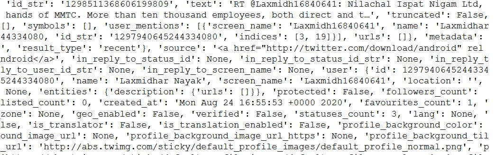
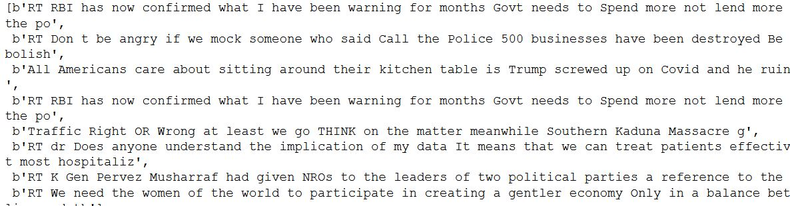
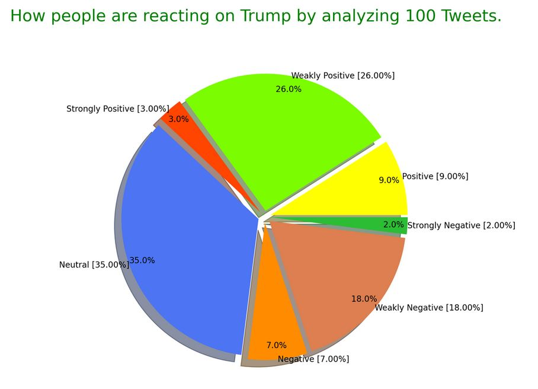

# Fetching Analyzing and Visualizing Tweets

[Tweets Analysis App](https://tweets--analysis.herokuapp.com/)

It is a web app project based on **Natural Language Processsing (NLP)**. The idea is to fetch tweets based on a keyword, clean the tweets and classify them in different Setiment categories like as positive, negative, strongly positive, neutral etc. With this we can know how people thinks about a particular topic on twitter. This is the *sentiment analysis* of tweets where we can analyse how people are reacting.

**Sentiment Analysis** come in handy in case of *reviews* i.e how much audience liked a movie, how much positive reviews are there for a product and many more.

## Natural Language Processing
Natural Language Processing, usually shortened as NLP, is a branch of artificial intelligence that deals with the *interaction between computers and humans using the natural language.*
The ultimate objective of NLP is to read, understand, and make sense of the human languages in a manner that is valuable.
Most NLP techniques rely on machine learning to derive meaning from human languages.

***1. Here I have used Tweepy module that is used to fetch tweets from twitter using some authentic keys.***

***2. Fetched tweets are then cleaned by removing special characters and links to make text relevent for processing.***


Before Cleaning                                                           |  After Cleaning
:------------------------------------------------------------------------:|:-------------------------:
[](screenshots/dirty.JPG)   |  [](screenshots/cleaned.JPG)

***3. Polarity of each tweet is calculated***

Mathematically Polarity is defined as float which lies in the range of ```[-1,1]``` where 1 means positive statement and -1 means a negative statement.
```
polarity  =       0        ----> Neutral
polarity  =  0 to 0.30     ----> Weak Positive
polarity  =  0.30 to 0.60  ----> Positive
polarity  =  0.60 to 1.00  ----> Strong Positive
polarity  = -0.30 to 0     ----> Weak Negative
polarity  = -0.60 to -0.30 ----> Negative
polarity  = -1.00 to -0.60 ----> Strong Negative
```

***3. Percentage for each sentiment or polarity is calculated separately like for positive, negative, neutral etc.***


***4. The derived information is then plotted using a Pie chart***

[](screenshots/pie.JPG)
